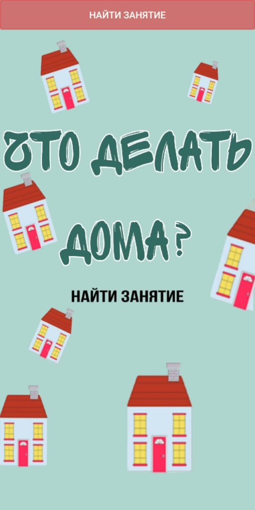
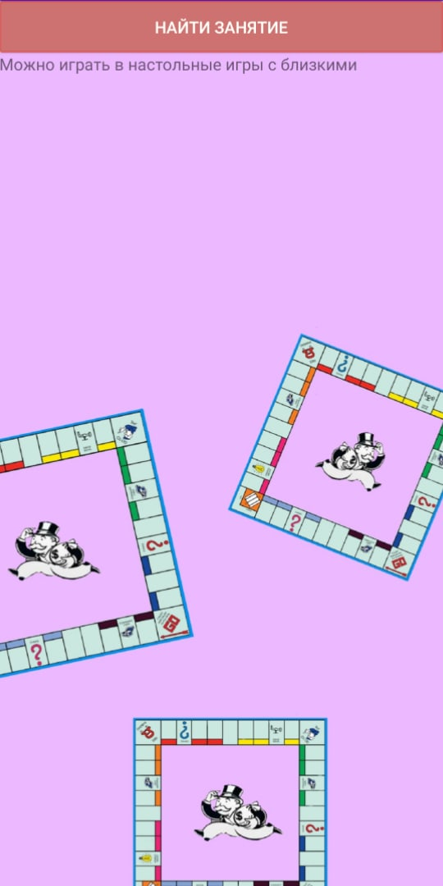
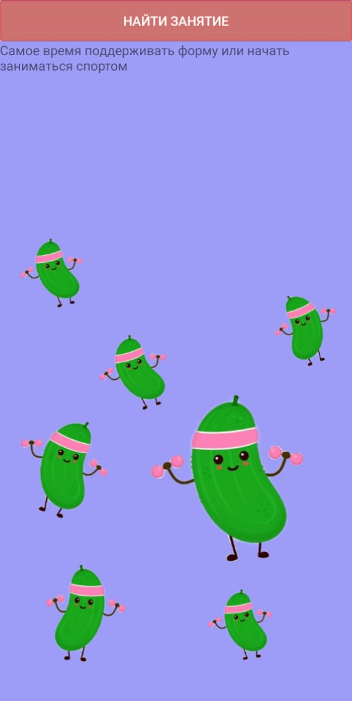
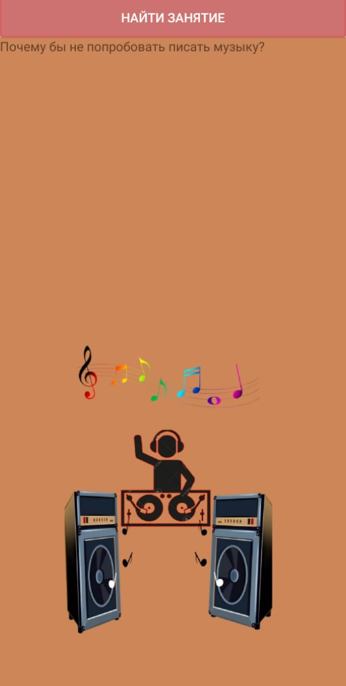
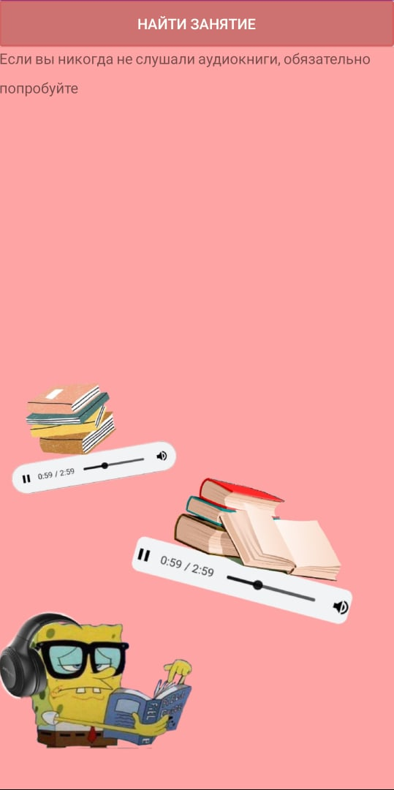
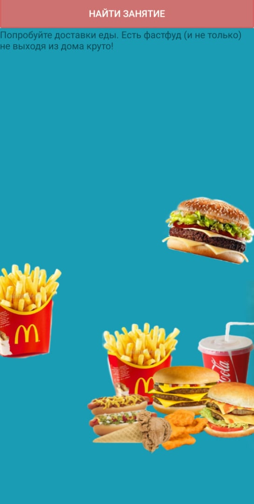
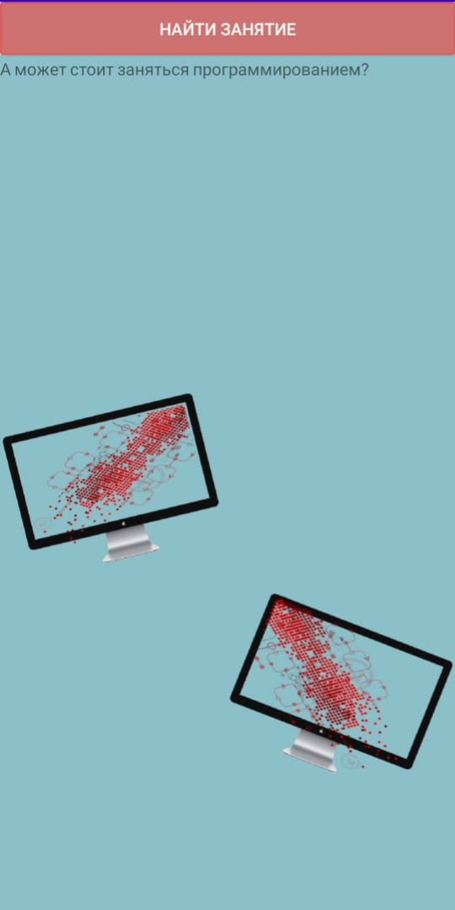
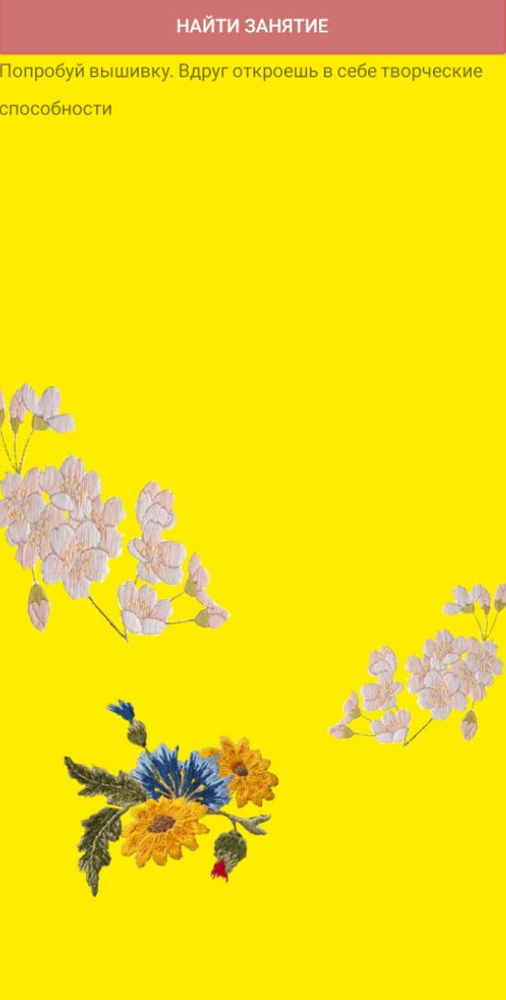
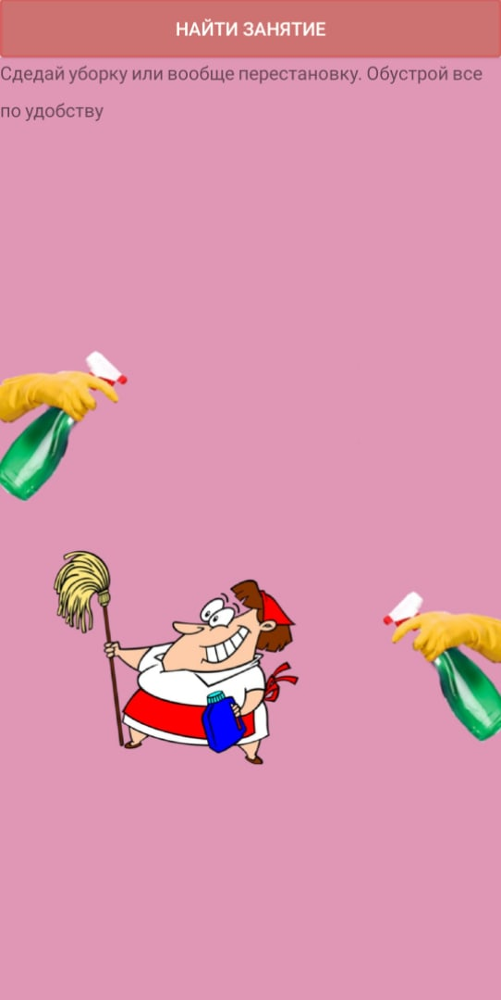

# Quarantine
**Random activity generator**
=====
First on the main screen main fragment 

By button "Найти занятие" it is replaced by another random fragment:

Fragments always change. App can't shows two same in a row
